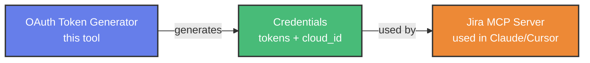
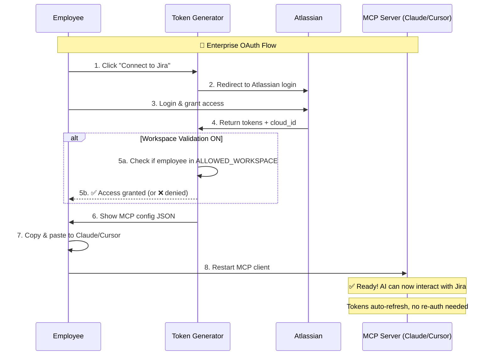

# 🔐 Jira OAuth Token Generator

**Purpose:** Generate OAuth credentials for [Jira MCP Server](https://github.com/dongitran/Jira-MCP-Server) the easy way - just click and copy/paste!

## 🎯 What does this tool do?

Instead of manually implementing the complex OAuth 2.0 flow, you simply:
1. Run this server
2. Click "Connect to Jira"
3. Get ready-to-use credentials for Jira MCP Server

**Relationship between the two projects:**



## ⚡ Quick Start

### 1️⃣ Installation

```bash
git clone https://github.com/dongitran/Jira-Oauth-Token-Generator.git
cd Jira-Oauth-Token-Generator
npm install
```

### 2️⃣ Create Atlassian OAuth App

1. Go to [Atlassian Developer Console](https://developer.atlassian.com/console/myapps/)
2. Create OAuth 2.0 integration
3. Callback URL: `http://localhost:3001/auth/callback`
4. Add permissions: `read:jira-user`, `read:jira-work`, `manage:jira-project`, `write:jira-work`, `offline_access`, `read:me`
5. Copy **Client ID** and **Client Secret**

### 3️⃣ Configuration

Create `.env` file:

```env
JIRA_ATLASSIAN_CLIENT_ID=your_client_id
JIRA_ATLASSIAN_CLIENT_SECRET=your_client_secret
JIRA_REDIRECT_URI=http://localhost:3001/auth/callback
PORT=3001
```

### 4️⃣ Run

```bash
npm start
# or: npm run dev (auto-reload)
# or: pm2 start ecosystem.config.js
```

## 🏢 Use Case: Enterprise Setup

### Why should companies use this?

**Problem:** Companies want their dev/PM teams to use AI (Claude, Cursor) to interact with Jira, but setting up OAuth for each person is complex and time-consuming.

**Solution:** Deploy a centralized OAuth Token Generator:

```
┌─────────────────────────────────────────────────────────────┐
│                      Company Workflow                       │
├─────────────────────────────────────────────────────────────┤
│                                                             │
│  1. IT Admin setup OAuth Generator (one-time only)          │
│     ├─ Create Atlassian OAuth App for company               │
│     ├─ Deploy internal server (or localhost)                │
│     └─ Set ALLOWED_WORKSPACE = "company-jira"               │
│                                                             │
│  2. Employees self-serve credentials (few clicks)           │
│     ├─ Open internal URL or localhost                       │
│     ├─ Click "Connect to Jira"                              │
│     ├─ Copy config JSON                                     │
│     └─ Paste into Claude/Cursor                             │
│                                                             │
│  3. Result                                                  │
│     ├─ ✅ Entire team can use AI + Jira integration         │
│     ├─ ✅ Workspace validation ensures only company staff   │
│     ├─ ✅ Tokens auto-refresh, no re-setup needed           │
│     └─ ✅ IT setup once, devs self-serve                    │
│                                                             │
└─────────────────────────────────────────────────────────────┘
```

## 🔄 OAuth Flow



## 📖 How to Use

### Step 1: Authenticate
1. Open [http://localhost:3001](http://localhost:3001)
2. Click **"Connect to Jira"**
3. Login to Atlassian and grant access

### Step 2: Copy config
The server will display JSON config like this:

```json
{
  "jira": {
    "command": "jira-mcp-server",
    "args": [
      "--access_token", "eyJhbGc...",
      "--refresh_token", "eyJhbGc...",
      "--client_id", "...",
      "--client_secret", "...",
      "--cloud_id", "..."
    ],
    "env": {}
  }
}
```

Click **"Copy Config"** to copy.

### Step 3: Use in MCP Client

**Claude Desktop:**
```bash
# open config file
open ~/Library/Application\ Support/Claude/claude_desktop_config.json

# paste into "mcpServers" section
# restart Claude Desktop
```

**Cursor:**
- Create `.cursor/mcp.json` → paste config → restart

**VS Code (Kiro):**
- Create `.kiro/settings/mcp.json` → paste config → restart

✅ **Done!** Tokens will auto-cache and refresh.

## 🔒 Security Features

- **CSRF Protection**: UUID state tokens prevent attacks
- **Workspace Validation**: Only company employees can authenticate
- **Token Caching**: Tokens stored locally (~/.jira-mcp/), not sent over network
- **Session Expiry**: Auth sessions auto-delete after 10 minutes
- **No Database**: Stateless design, no sensitive data storage

## 📚 Related Links

- [Jira MCP Server](https://github.com/dongitran/Jira-MCP-Server) - MCP server that uses these credentials
- [Model Context Protocol](https://modelcontextprotocol.io) - Learn about MCP

## 👨‍💻 Author

**dongtran** ✨

## 📄 License

MIT

---

Made with ❤️ to make your work life easier!
